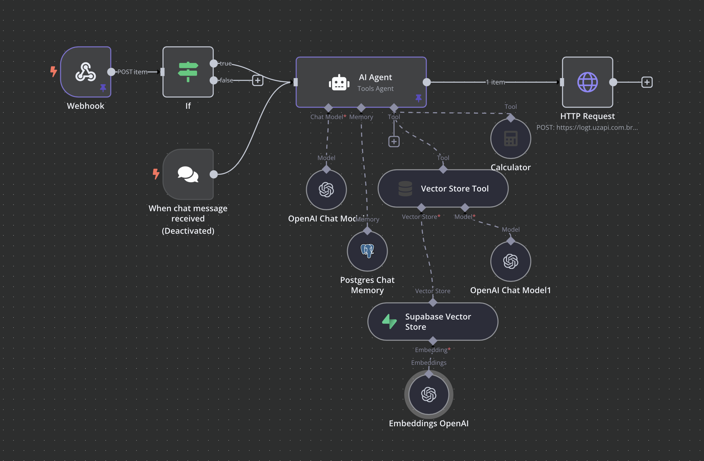
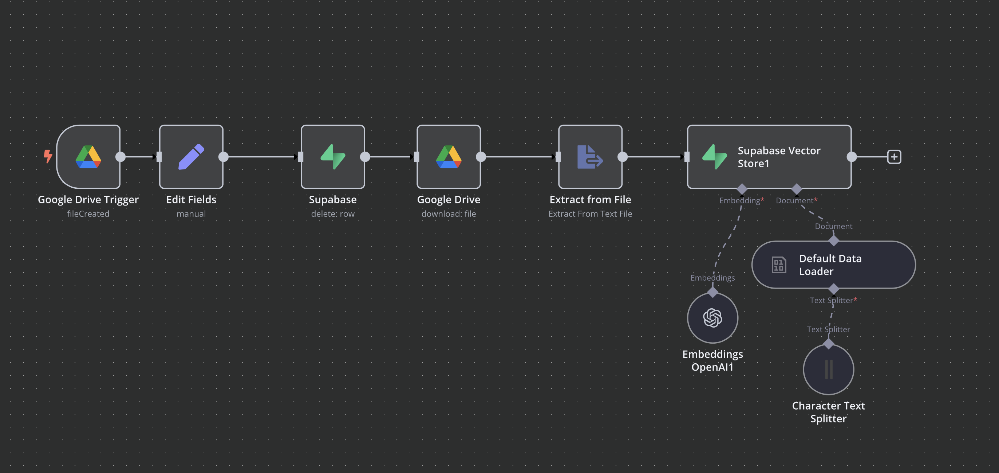

# **i.ai Dr? – Agente RAG para n8n e WhatsApp**  

🚀 **i.ai Dr** é um agente conversacional baseado em **RAG (Retrieval-Augmented Generation)**, desenvolvido para integrar o **n8n** e **WhatsApp**, trazendo respostas mais inteligentes e contextuais a partir de uma base de conhecimento específica.  

🛠️ **Criado durante o HackaHealth**, o projeto visa facilitar o acesso a informações médicas e aprimorar a comunicação automatizada, utilizando modelos de IA e fluxos de automação no **n8n**.  

---

## ✨ **Principais Recursos**  

- 🔍 **RAG (Retrieval-Augmented Generation)** – Melhoria na precisão das respostas, combinando recuperação de dados com geração de texto.  
- 🤖 **Integração com n8n** – Automação flexível para gerenciar interações no WhatsApp.  
- 📲 **WhatsApp Bot (UZAPI)** – Comunicação em tempo real com pacientes ou usuários via API do **[UZAPI](https://go.hotmart.com/S93231722N)**.  
- 🗂 **Integração com Google Drive** – O agente acessa arquivos armazenados em uma pasta específica no **Google Drive** para treinar o modelo e enriquecer a base de conhecimento.  
- 💾 **Supabase como Database** – O **Supabase** é utilizado para armazenar os documentos recuperados do Google Drive, permitindo downloads e consultas rápidas.  
- 🔄 **Extensível e Personalizável** – Pode ser ajustado para diferentes bases de conhecimento e necessidades.  

---

## 🚀 **Como Funciona?**  

1️⃣ O usuário envia uma pergunta pelo WhatsApp via **UZAPI**.  
2️⃣ O agente consulta uma base de conhecimento treinada a partir de documentos armazenados no **Google Drive** e salvos no **Supabase**.  
3️⃣ O modelo de IA processa as informações e combina os dados recuperados com uma resposta gerada.  
4️⃣ O **n8n** gerencia o fluxo da conversa e envia a resposta ao usuário pelo WhatsApp.  

---

## 🛠 **Tecnologias Utilizadas**  

- **n8n** – Para automação e orquestração dos fluxos de conversa.  
- **OpenAI API** – Para processamento e geração de linguagem.  
- **Vector Database** – Para armazenamento e recuperação eficiente de informações.  
- **WhatsApp API (UZAPI)** – Para interação com os usuários via WhatsApp.  
- **Google Drive API** – Para acessar e baixar documentos usados no treinamento do modelo.  
- **Supabase** – Para armazenar os arquivos e permitir o download eficiente dos documentos.  
- **[Supabase Vector Store Node](https://docs.n8n.io/integrations/builtin/cluster-nodes/root-nodes/n8n-nodes-langchain.vectorstoresupabase/)** – Para armazenar os embeddings e realizar buscas no banco de dados vetorial.  




---

## 📌 **Contribuindo**  

O projeto está aberto para melhorias! Sinta-se à vontade para abrir **issues**, enviar **PRs** ou sugerir novas funcionalidades.  

---

## 🎯 **Sobre o HackaHealth**  

Este projeto foi desenvolvido durante o **HackaHealth**, um evento focado em soluções tecnológicas para a área da saúde.  

💡 **Quer colaborar ou testar?** Explore o repositório e contribua! 🚀  

---

## 📖 **Tutorial de Configuração e Uso**  

### 1️⃣ **Importar o processo no n8n**  

- Baixe o arquivo **JSON** contendo o fluxo do **n8n** (disponível no repositório).  
- Acesse sua instância do **n8n** e clique em **Import Workflow**.  
- Selecione o arquivo **JSON** e importe o fluxo. 
- Arquivo: ```Agente_IA_RAG.json```

### 2️⃣ **Configurar acesso ao Google Drive**  

- No **n8n**, adicione uma credencial da **Google Drive API**.  
- Selecione a pasta onde os documentos para treinamento serão armazenados.  

### 3️⃣ **Configurar o Supabase**  

- No **n8n**, utilize o **Supabase Vector Store Node** para armazenar e recuperar os documentos vetorizados.  
- Siga a documentação oficial: **[n8n Supabase Vector Store](https://docs.n8n.io/integrations/builtin/cluster-nodes/root-nodes/n8n-nodes-langchain.vectorstoresupabase/)**.  
- Configure suas credenciais do **Supabase** e defina os parâmetros corretamente.  

### 4️⃣ **Configurar a API do WhatsApp (UZAPI)**  

- Cadastre-se no **[UZAPI](https://go.hotmart.com/S93231722N)** e obtenha suas credenciais.  
- No **n8n**, adicione a API do **UZAPI** para gerenciar mensagens no WhatsApp.  

### 5️⃣ **Testar e Rodar o Agente RAG**  

- Execute o fluxo no **n8n**.  
- Envie uma mensagem de teste via WhatsApp.  
- O agente consultará a base de conhecimento, processará a resposta e retornará ao usuário.  

---

## 📌 **Pronto!**  

Agora seu **i.ai Dr?** está configurado e pronto para responder perguntas no **WhatsApp** utilizando IA e RAG. 🚀  
Caso tenha dúvidas ou queira contribuir, abra uma **issue** no repositório!  
